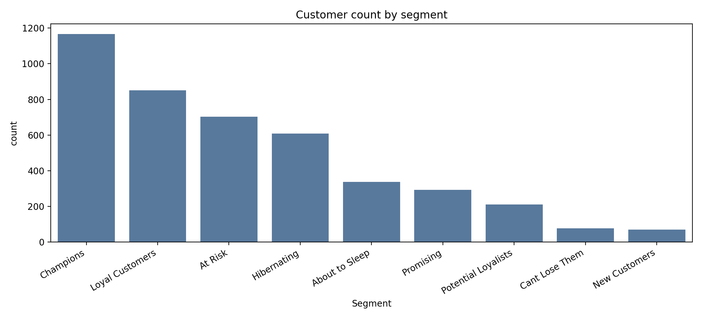
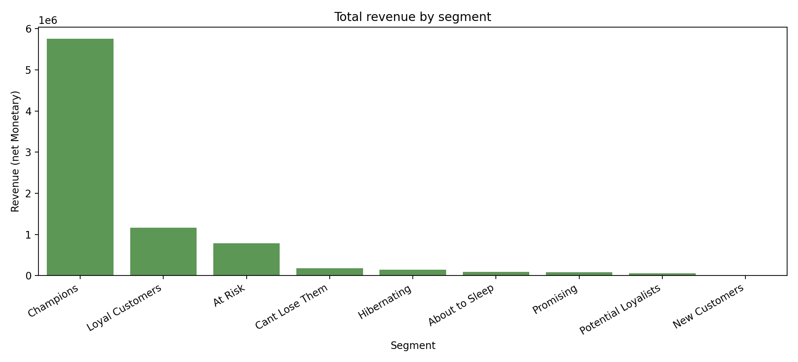
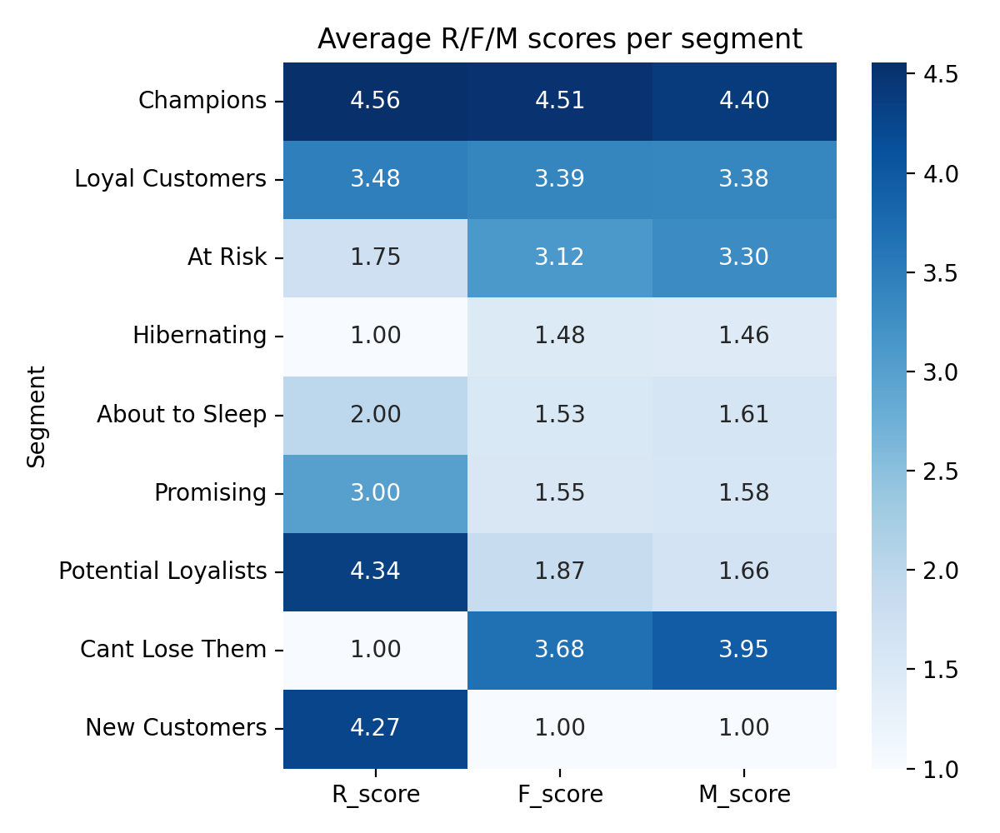

# RFM Customer Segmentation (Online Retail)

## Motivation
Segment customers using **Recency, Frequency, and Monetary value (RFM)** to identify high-value
customers and propose targeted marketing actions.

## Data
Source: UCI Machine Learning Repository — Online Retail dataset (01/12/2010 to 09/12/2011).
Link: https://archive.ics.uci.edu/dataset/352/online+retail

The raw file has 541,909 line items. After cleaning we retain **399,656 line items** covering
**4,320 customers**.

## Method

### 1. Cleaning (`01_load_and_clean.ipynb`)
- Drop rows with missing `CustomerID` (can't attribute to a customer).
- Drop **exact duplicate rows** (~5.2k).
- Drop **non-product service codes** — postage (`POST`, `DOT`), manual adjustments (`M`),
  bank charges, Amazon fees, gift-card and discount codes, etc. We keep only `StockCode`s that
  start with 5 digits.
- Drop rows with `UnitPrice <= 0`.
- **Flag returns** (`Quantity < 0` or `InvoiceNo` starting with `C`) so they can be netted out of Monetary.

### 2. RFM table + scoring (`02_rfm_table.ipynb`)
- **Recency** = days since last purchase (sales lines only).
- **Frequency** = number of unique purchase invoices.
- **Monetary** = total spend **net of returns**. Customers whose net spend is ≤ 0 are dropped.
- Score R/F/M into 1–5 quintiles with `qcut` on the **rank** (balanced bins even with ties).
- Combine F and M into a single **FM** score and map each customer to a segment using an
  exhaustive Recency × FM matrix — **every customer gets exactly one segment (no catch-all "Others")**.

### 3. SQL analysis (`04_sql_rfm_analysis.ipynb`)
Loads the scored table into SQLite and answers business questions. Segment counts match
notebook 02 exactly (it queries the same labels rather than a second set of rules).

### 4. Tableau export (`05_tableau_csv.ipynb`)
Flattens the scored table into `tableau_data.csv`.

### 5. K-Means cross-check (`06_kmeans_clustering.ipynb`)
Unsupervised sanity check: cluster customers on **log-transformed, standardized** R/F/M
(k selected via elbow + silhouette). The data-driven clusters closely mirror the rule-based
segments — e.g. one tight cluster of recent, frequent, high-spend customers (Champions).

## Results

### Segment counts


### Revenue by segment


### Average scores by segment


**Key findings (4,320 real customers, ~£8.27M net revenue):**
- **Champions** (1,166 customers) contribute **~£5.75M** revenue with average recency ~13 days —
  ~70% of revenue from ~27% of customers.
- **Hibernating** (609 customers) show average recency ~278 days and contribute only ~£143.6k.
- Revenue is heavily concentrated: retaining Champions and reactivating At-Risk / Can't-Lose-Them
  customers is where the money is.

Output files (`Data/Processed/`):
- `transactions_clean.csv` — cleaned line items (sales + flagged returns)
- `rfm_table.csv` — Recency / Frequency / net Monetary per customer
- `rfm_scored_segments.csv` — RFM scores + segment labels
- `segment_summary.csv` — per-segment aggregates
- `tableau_data.csv` — flat file for Tableau/Power BI
- `rfm_kmeans.csv` — RFM table with K-Means cluster labels
- `rfm_database.db` — SQLite database used in notebook 04

## Business actions
- **Champions / Loyal Customers**: loyalty perks, referrals, early access, upsell/cross-sell.
- **Potential Loyalists / Promising / New Customers**: onboarding nudges, second-purchase offers.
- **At Risk / Can't Lose Them**: personalized win-back campaigns (these were valuable — prioritize).
- **About to Sleep / Hibernating**: low-cost reactivation flow (reminder + incentive).

## How to run
1. Install dependencies:
   ```bash
   pip install -r requirements.txt
   ```
2. Download the dataset from UCI and place it here:
   ```
   Data/Raw/Online Retail.xlsx
   ```
3. Run notebooks in order: `01` → `02` → `04` → `05` → `06`.

## Repository structure
```
rfm-customer-segmentation/
├── Data/
│   ├── Raw/                  # Raw dataset (not committed)
│   └── Processed/            # Cleaned + RFM outputs
├── Notebooks/                # 01 clean · 02 RFM · 04 SQL · 05 Tableau · 06 K-Means
├── Reports/Figures/          # Exported plots
├── requirements.txt
└── README.md
```

## Notes
- Monetary is **net of returns**; service/postage/fee codes are excluded, so revenue totals are
  lower (and more accurate) than a naïve sum of all positive line items.
- This project analyses the **real 4,320 customers only**. An earlier synthetic-augmentation
  step was removed — inventing customers distorted the quintile boundaries and re-labeled real
  customers, which is not valid for drawing business conclusions.
- A Tableau Public dashboard link will be re-added once the dashboard is rebuilt on the
  corrected real-data export.
```

